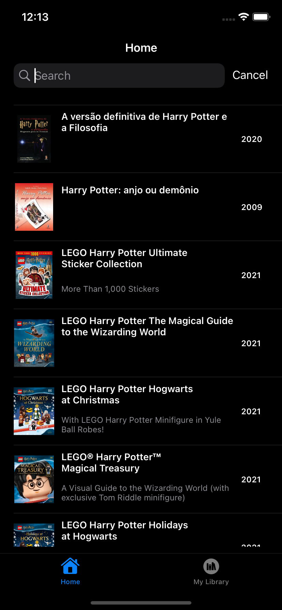
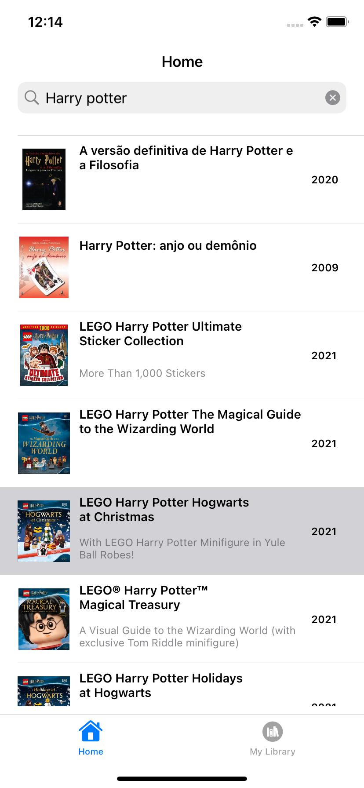

# InBooks
<!---Esses são exemplos. Veja https://shields.io para outras pessoas ou para personalizar este conjunto de escudos. Você pode querer incluir dependências, status do projeto e informações de licença aqui--->


<div align="center">
    
    
</div>

> O inBooks tem como objetivo mostrar livros do Mercado Editorial, permitindo ao usuário pesquisar a partir do título do livro e guardar seus livros escolhidos em sua biblioteca

## 💻 Pré-requisitos

Antes de começar, verifique se você atendeu aos seguintes requisitos:
<!---Estes são apenas requisitos de exemplo. Adicionar, duplicar ou remover conforme necessário--->
* Você tem uma máquina com `MacOs` e o `Xcode` corretamente instalado
* `Swift 5.5` e target `iOS 13+`
* `Cocoapods` instalado com o comando `pod` funcionando

## 🚀 Instalando InBooks

Para instalar o InBooks, é necessário rodar o comando na pasta raiz do projeto:

``` bash
    pod install
```

Para rodar a aplicação, basta abrir o arquivo `InBooks.xcworkspace` e rodar pelo Xcode. Também é possível instalar diretamente em um simulador do iPhone com o executável `InBooks.app` em Releases do repositório. Para rodar os testes, basta rodar o comando `Command + U` no Xcode.


## Features implementadas

### Arquitetura
O projeto foi desenvolvido utilizando a arquitetura `MVVM-C`, com todas os componentes de interface criados programaticamente (`viewCode`). Utilizou-se do conceito de separação de responsabilidades, com a `ViewModel` responsável por dados e lógicas da aplicação, a `View` responsável por componentes de interface, a `ViewController` o componente principal com as interações e conexões entre os outros componentes, e o `Coordinator` responsável pelo fluxo entre as telas

Foi utilizado o padrão de `Delegates` ao longo de todo o projeto

### Telas
As telas implementadas foram:
* `Home`: Contém os livros vindo da API, com uma UISearchBar para pesquisa
* `Library`: Contém os livros salvos na biblioteca do usuário
* O aplicativo possui Dark Mode e Light mode

### Testes automatizados
Foram implementados alguns testes automatizados:
* Teste unitário testando o método ClassIdentifier
* Teste do `Network Service`, testando o método de requisitar informações para a API com base em um JSON mockado
* Teste de UI padrão, testando abertura do App

## 📱 Gifs demonstrando aplicação

<div align="center">
    
</div>


## 📝 Licença

Esse projeto está sob licença MIT. Veja o arquivo [LICENÇA](LICENSE.md) para mais detalhes.

[⬆ Voltar ao topo](#nome-do-projeto)<br>